# Screen Sharing Architecture

This document explains how screen sharing works in Kaiku, from the moment a user clicks "Share Screen" to the video appearing on other participants' screens.

## Overview

Kaiku uses an **SFU (Selective Forwarding Unit)** architecture. The server doesn't encode or decode video — it receives RTP packets from the publisher and forwards them to all subscribers. Each user has two WebRTC connections:

- **Publisher PC** — sends the user's own tracks (mic, screen share, webcam) to the server
- **Subscriber PC** — receives other users' tracks from the server

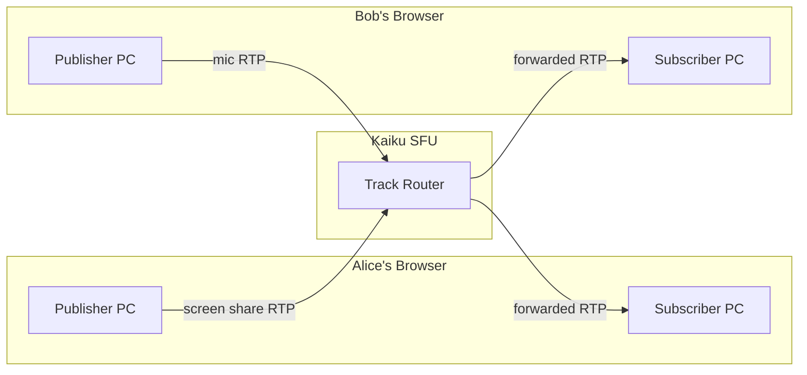

## The Complete Flow

### Step 1: User Starts Screen Share

When Alice clicks "Share Screen", the browser captures the screen using `getDisplayMedia()`:

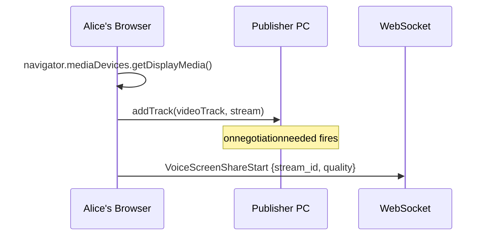

The quality setting controls resolution and framerate:

| Quality | Resolution | FPS | Bitrate |
|---------|-----------|-----|---------|
| Low | 854×480 | 15 | 500 Kbps |
| Medium | 1280×720 | 30 | 1.5 Mbps |
| High | 1920×1080 | 30 | 3 Mbps |
| Premium | 1920×1080 | 60 | 5 Mbps |

### Step 2: SDP Negotiation (Publisher)

The client creates an offer and sends it to the server. The server creates an answer. This is the **publisher** SDP exchange — only the publishing client and server participate.

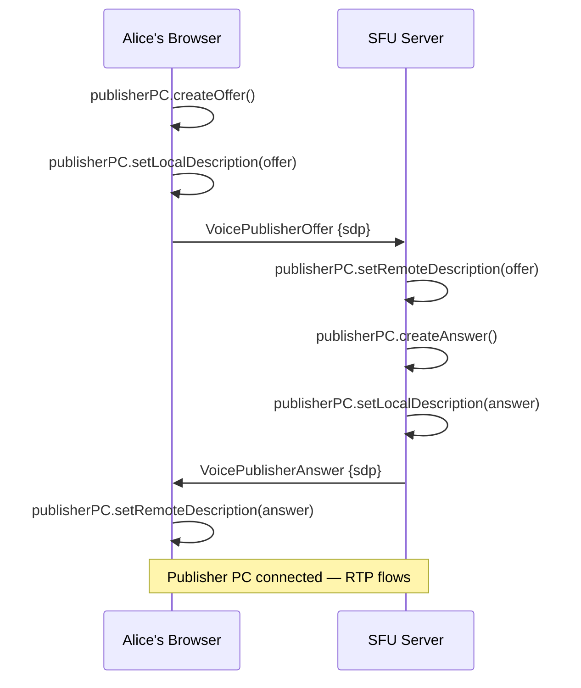

### Step 3: Server Receives the Track

When the SDP exchange completes, the server's `on_track` callback fires. This is where the heavy lifting happens:

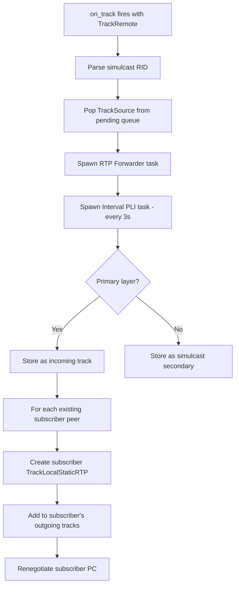

**Key detail: Interval PLI.** The server spawns a task that sends a Picture Loss Indication (PLI) to the publisher every 3 seconds. This forces the publisher's browser to generate keyframes, ensuring any subscriber joining later gets a fresh keyframe within 3 seconds. Without this, subscribers see a black screen until a natural keyframe arrives (which can take minutes for static screen content).

> **Why interval PLI?** webrtc-rs's `PeerConnection::write_rtcp()` doesn't reliably deliver one-shot PLI to the remote browser. The Pion SFU pattern of sending PLI on a fixed interval is the proven workaround.

### Step 4: RTP Forwarding

The RTP forwarder reads packets from the publisher's track and writes them to all subscriber tracks:

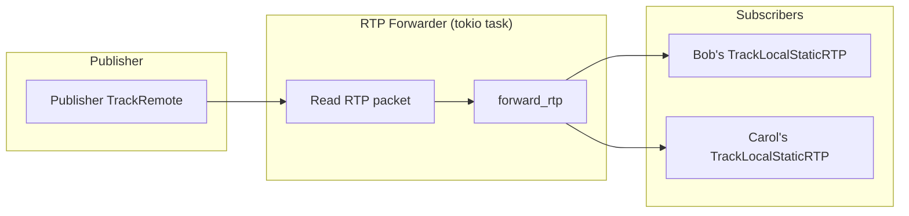

The `TrackRouter` manages subscriptions using a lock-free `DashMap`:

```
subscriptions: Map<(source_user_id, TrackSource), Vec<Subscription>>
```

Each `Subscription` contains:
- `subscriber_id` — who receives this track
- `local_track` — the `TrackLocalStaticRTP` to write RTP packets to
- `active_layer` — which simulcast layer is active (High/Medium/Low)

For non-simulcast sources (screen share via `addTrack` without RID), all packets are forwarded regardless of `active_layer`.

### Step 5: SDP Negotiation (Subscriber)

After creating subscriber tracks, the server renegotiates each subscriber's PC:

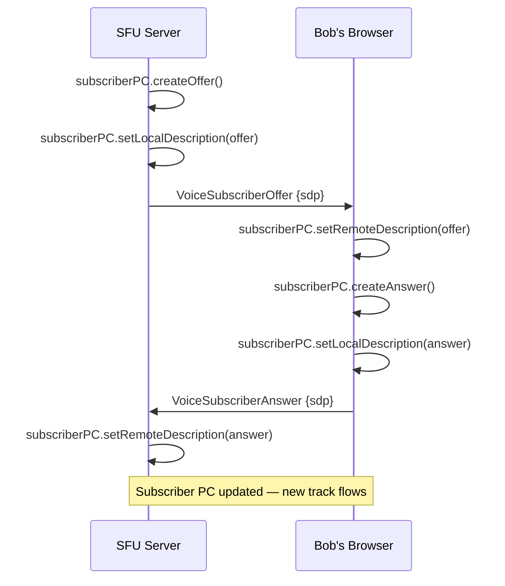

### Step 6: Video Arrives at Subscriber

When the subscriber's browser receives the new track via `ontrack`:

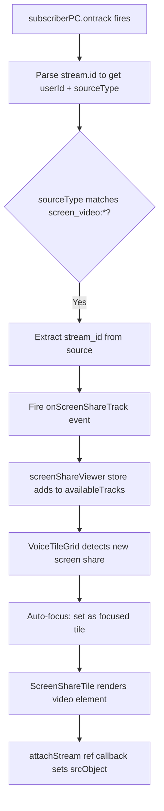

The stream ID format used in WebRTC track naming:
```
"{user_id}:{source_type}"
e.g. "58b286b0-...:screen_video:9e23fc36-..."
```

The client parses this to determine the source user and type.

## Codec: VP8 Only

All video uses VP8 (payload type 96). The server registers only VP8 in its `MediaEngine` — no VP9 or H.264. This guarantees that both publisher and subscriber sessions negotiate the same payload type, which is critical because the SFU forwards raw RTP packets without rewriting headers.

```
Publisher browser ←→ Server publisher PC: VP8 PT 96
Server subscriber PC ←→ Subscriber browser: VP8 PT 96
```

If different payload types were negotiated on each side, the subscriber's decoder would receive packets with an unrecognized PT and show a black screen.

## ICE and Connectivity

Each PeerConnection exchanges ICE candidates independently, tagged with a `PcType` enum (`Publisher` or `Subscriber`):

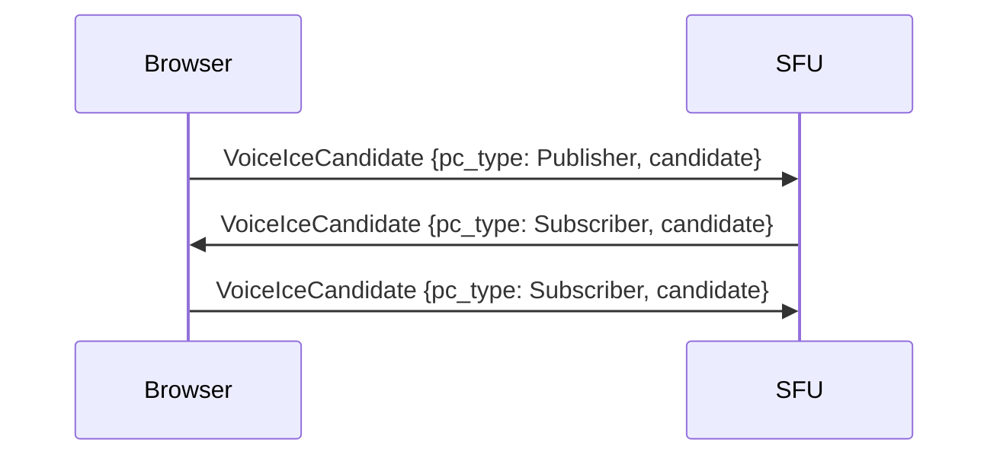

STUN/TURN servers are fetched from the API at connection time. If TURN is unavailable, the client falls back to a public STUN server with a UI warning.

## Screen Share UI

The voice channel view uses a **tile-based layout** with two modes:

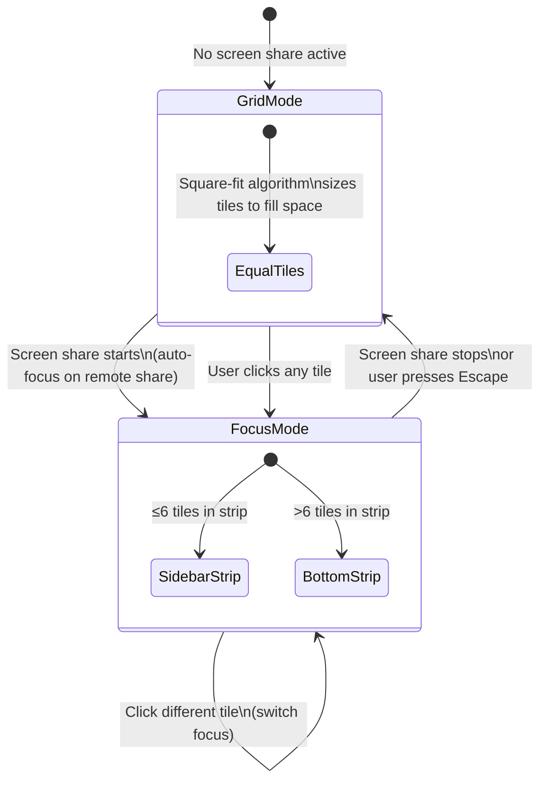

**Grid Mode:** All participant + screen share tiles displayed equally using a square-fit algorithm (4:3 aspect ratio, max 5 columns).

**Focus Mode:** One large tile (the focused screen share) + remaining tiles in a sidebar (≤6) or bottom strip (>6).

**Pop-out:** Screen share tiles have a pop-out button that opens the stream in a separate browser window. The main tile shows "Popped out" with a "Bring back" button.

## Late Joiner Flow

When Bob joins a channel where Alice is already sharing:

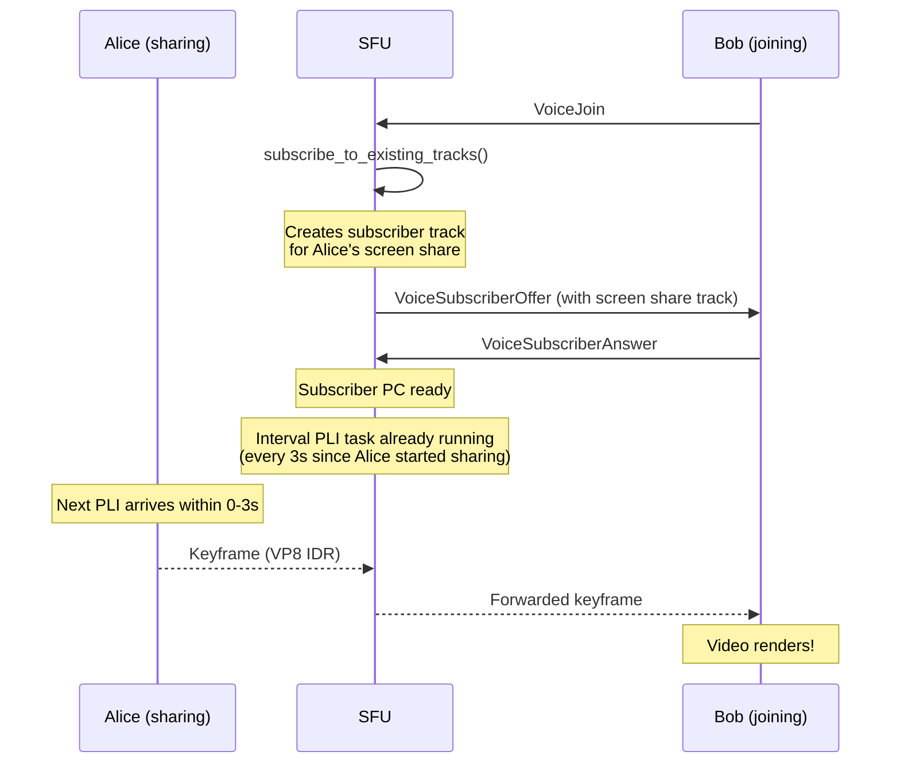

The maximum wait time for a keyframe is 3 seconds, determined by the PLI interval.

## Screen Share Stop Flow

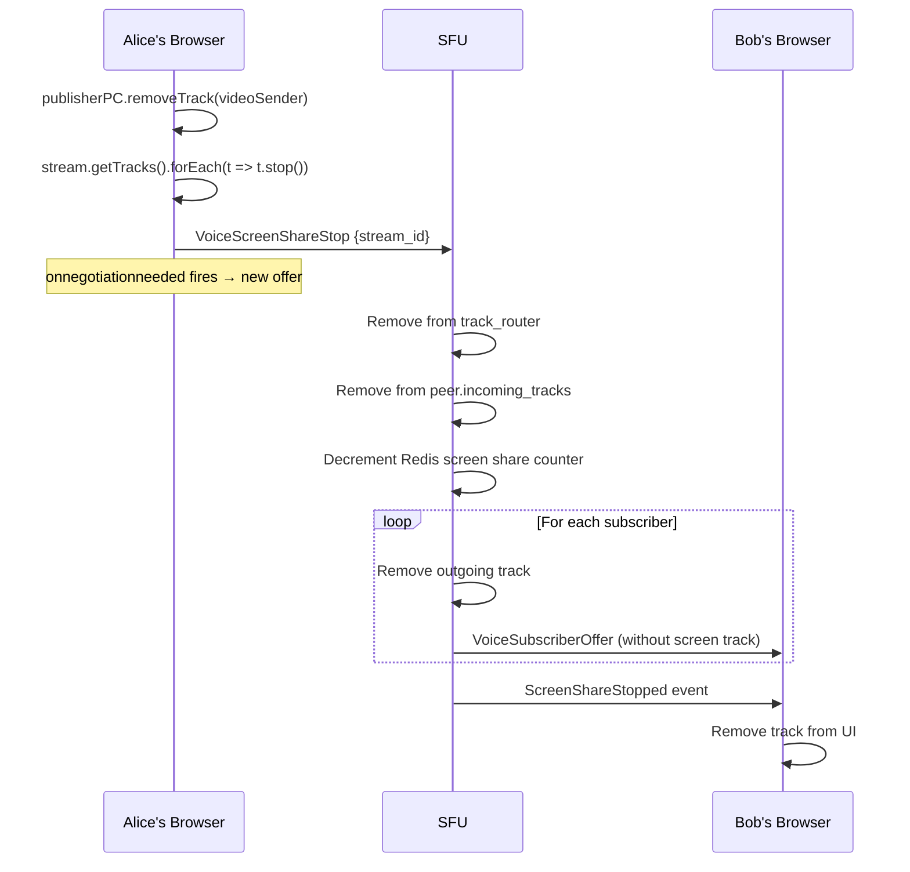

## Key Files

| File | Purpose |
|------|---------|
| `server/src/voice/sfu.rs` | SFU core: PeerConnection setup, on_track handler, PLI interval, renegotiation |
| `server/src/voice/track.rs` | TrackRouter: RTP forwarding, subscriptions, simulcast layer selection |
| `server/src/voice/ws_handler.rs` | WebSocket message handlers for all voice signaling |
| `server/src/voice/peer.rs` | Peer state: publisher/subscriber PCs, track storage |
| `client/src/lib/webrtc/browser.ts` | Browser WebRTC adapter: screen capture, SDP negotiation, track handling |
| `client/src/components/voice/VoiceTileGrid.tsx` | Tile layout manager: grid/focus modes, auto-focus |
| `client/src/components/voice/VoiceTile.tsx` | Individual tile: video attachment, pop-out button |
| `client/src/components/voice/screenSharePopOut.ts` | Pop-out window management |
| `shared/vc-common/src/protocol/mod.rs` | Protocol message types (ClientEvent, ServerEvent, PcType) |
