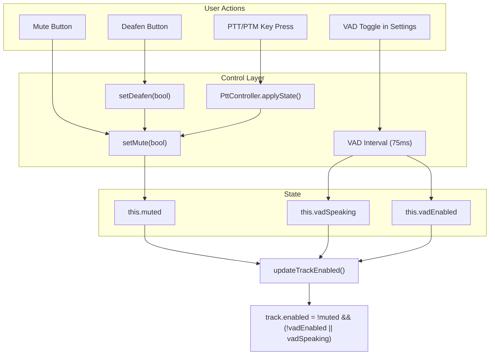
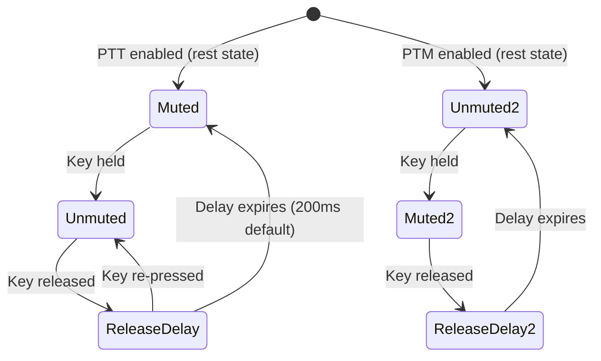
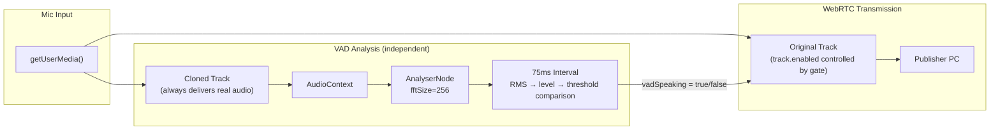

# Voice Transmission Control Architecture

How Kaiku decides whether your microphone audio reaches other participants. Every control mechanism — mute, PTT, VAD gating, deafen — ultimately flows through a single gate: `track.enabled` on the audio track sent to the Publisher PeerConnection.

## The Central Gate

All transmission decisions converge in one method:

```typescript
// browser.ts — BrowserVoiceAdapter
private updateTrackEnabled(): void {
  const enabled = !this.muted && (!this.vadEnabled || this.vadSpeaking);
  this.localStream.getAudioTracks().forEach(track => {
    track.enabled = enabled;
  });
}
```

**Truth table:**

| Muted | VAD Enabled | Speaking | Track Enabled | Audio Transmitted |
|-------|-------------|----------|---------------|-------------------|
| true  | any         | any      | false         | No                |
| false | false       | any      | true          | Yes               |
| false | true        | true     | true          | Yes               |
| false | true        | false    | false         | No                |

Mute always wins. When not muted, VAD gating controls whether audio flows.

## Control Stack



## Mute/Unmute

The simplest control. Directly sets `this.muted` and notifies the server.

```
toggleMute() → adapter.setMute(newState)
  → this.muted = newState
  → updateTrackEnabled()              // gate audio
  → wsSend({ type: "voice_mute" })   // tell other clients
  → onLocalMuteChange(muted)          // update UI
```

**Server notification:** Mute state is broadcast to all channel participants via WebSocket so they can show mute indicators. VAD gating does **not** send server notifications — it's a local, transparent optimization.

**Key files:**
- `browser.ts` — `setMute()` (line ~262)
- `voice.ts` — `toggleMute()`, `setMute()`

## Deafen

Deafen = mute yourself + silence all incoming audio. It chains into `setMute(true)` for the transmission side, then disables all remote audio tracks for the reception side.

```
setDeafen(true)
  → this.deafened = true
  → setMute(true)                                // stop transmitting
  → remoteStreams.forEach(s => s.tracks.enabled = false)  // stop hearing
```

Deafen is **client-local only** — no server notification. Other participants see you as muted (via the `voice_mute` message from the chained `setMute`).

**Key file:** `browser.ts` — `setDeafen()` (line ~281)

## Push-to-Talk / Push-to-Mute

PTT and PTM override the mute state via key press events. They call `setMute()` directly, so all the same gating logic applies.



**Priority:** PTM always wins over PTT if both keys are held simultaneously (safety-first: mute takes precedence).

**Release delay:** Configurable per-key (0–1000ms). Prevents clipping the last syllable when the user releases the key. The `PttController` uses `setTimeout` to defer the state change.

**PTT/VAD interaction:** When PTT is active, VAD gating is disabled via `adapter.setVadConfig(false, ...)`. The voice store handles this in `activatePtt()` / `deactivatePtt()`. When PTT is deactivated, VAD config is restored from user settings.

**Key files:**
- `pttManager.ts` — `PttController`, `resolveState()`, `createTauriPttListeners()`
- `voice.ts` — `activatePtt()`, `deactivatePtt()`, `syncVadConfig()`

## Voice Activity Detection (VAD) Gating

VAD monitors the microphone level and automatically gates audio when the user isn't speaking. This prevents transmitting background noise, keyboard clicks, and breathing.

### Architecture



**Why a cloned track?** Setting `track.enabled = false` on the original track makes it produce silence for all consumers — including any `AnalyserNode` connected to it. The cloned track is independent: it always delivers real mic audio regardless of the original's enabled state. This prevents a deadlock where the gate closes and can never detect speech to reopen.

### Detection Algorithm

Every 75ms:

1. Read frequency bins from AnalyserNode (`getByteFrequencyData`)
2. Compute average amplitude: `sum / binCount`
3. Normalize to 0–100 scale: `(average / 255) * 100 * 2`
4. Compare against user threshold (0.0–1.0 mapped to 0–100)
5. If level > threshold → speaking detected

### Hold Timer

When speech stops, the gate stays open for 300ms before closing. This prevents choppy audio during natural pauses between words or sentences.

```
Speech detected  → immediately open gate (vadSpeaking = true)
Speech stops     → start 300ms hold timer
                   → if speech resumes: cancel timer, gate stays open
                   → if timer expires: close gate (vadSpeaking = false)
```

### Configuration Flow

```
VoiceSettings UI → updateVoiceSetting("vad_threshold", 0.3)
  → settings.ts key routing → updateVadFromSettings()
  → voice.ts syncVadConfig() → adapter.setVadConfig(true, 0.3)
  → browser.ts updates vadEnabled/vadThreshold
  → clearVadHold(), vadSpeaking = false, updateTrackEnabled()
```

The threshold slider is debounced (150ms) to avoid excessive settings writes during rapid adjustment.

**Key files:**
- `browser.ts` — `startVAD()`, `stopVAD()`, `setVadConfig()`, `clearVadHold()`
- `voice.ts` — `syncVadConfig()`, `updateVadFromSettings()`
- `settings.ts` — `updateVoiceSetting()` key-based routing
- `VoiceSettings.tsx` — `ThresholdSlider` component

## Device Switch

Switching the input device mid-call replaces the audio stream. The VAD monitor track must be restarted because the cloned track references the old (now stopped) microphone.

```
setInputDevice(newDeviceId)
  → stopVAD()                          // old clone would deliver silence
  → localStream.getTracks().stop()     // stop old mic
  → getUserMedia({ deviceId: new })    // acquire new stream
  → sender.replaceTrack(newTrack)      // swap in publisher PC
  → startVAD()                         // fresh clone from new stream
```

**Key file:** `browser.ts` — `setInputDevice()` (line ~732)

## Noise Suppression

Browser-native noise suppression (`noiseSuppression` constraint) is separate from VAD gating. It processes the audio signal to reduce steady background noise (fans, AC), but does not mute/unmute the track. It's always applied to the transmitted audio if enabled.

See [noise-reduction.md](noise-reduction.md) for the full noise reduction specification.

## Speaking Indicator

The UI speaking indicator (avatar glow, voice tile highlight) is driven by `onSpeakingChange` events from the adapter.

When VAD gating is active, the indicator uses `vadSpeaking` (the gated state) rather than raw audio level. This means the indicator reflects what's actually being transmitted:

- During the 300ms hold period: indicator stays `true` (audio is still flowing)
- After hold expires: indicator goes `false` (audio is gated)

When VAD is off, the indicator uses raw level detection (`level > threshold`).

**Key file:** `browser.ts` — VAD interval loop (line ~1471)

## Remote Audio Control

Incoming audio from other participants is received on the Subscriber PeerConnection. Output routing uses the `setSinkId()` API to direct audio to the selected output device.

Deafen disables all remote audio tracks locally. Output device selection is independent of deafen state.

## Summary: What Controls What

| Mechanism | Controls | Server Notified | Affects Others |
|-----------|----------|-----------------|----------------|
| Mute | Local track transmission | Yes | See mute indicator |
| Deafen | Local track + remote playback | No (mute side: yes) | See mute indicator |
| PTT/PTM | Mute state via key events | Yes (via setMute) | See mute indicator |
| VAD gating | Local track transmission | No | Transparent |
| Noise suppression | Audio signal processing | No | Cleaner audio quality |
| Device switch | Stream replacement | No | Momentary gap |
